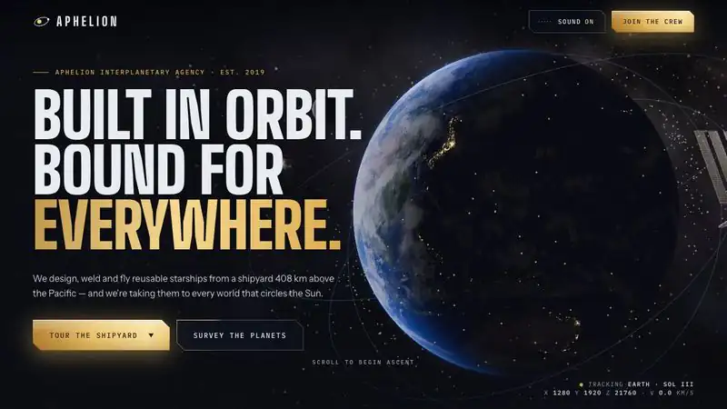
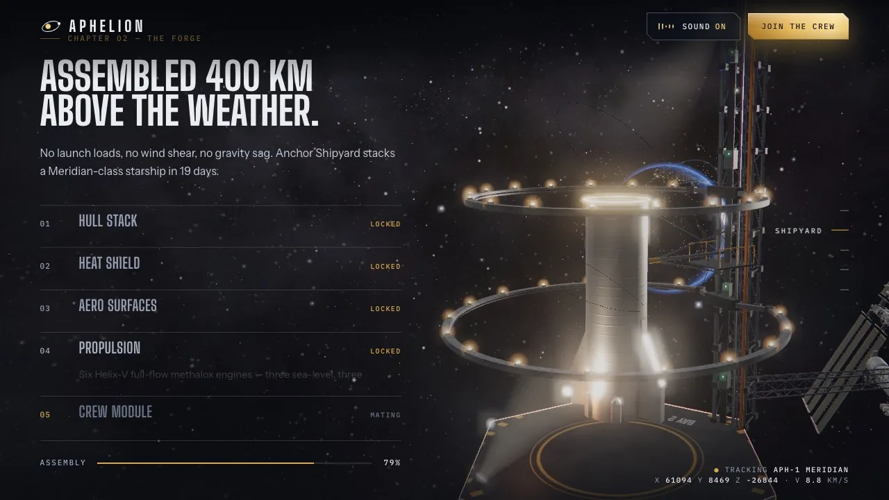
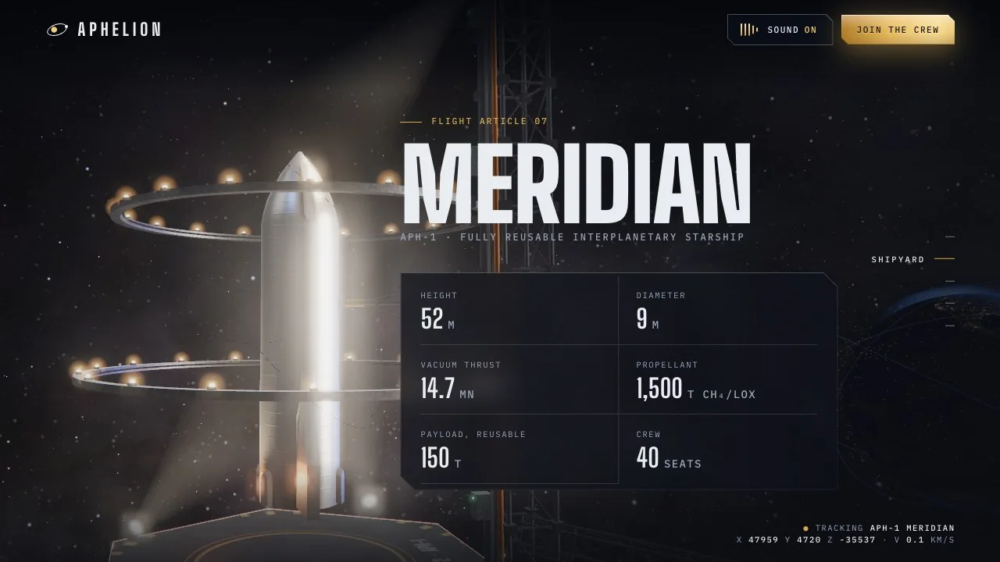
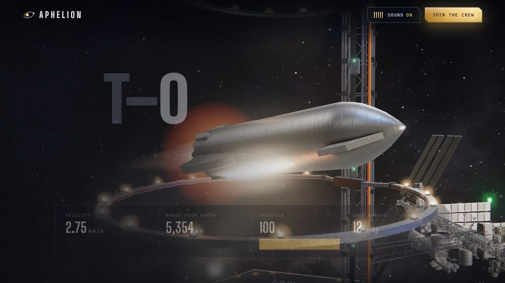
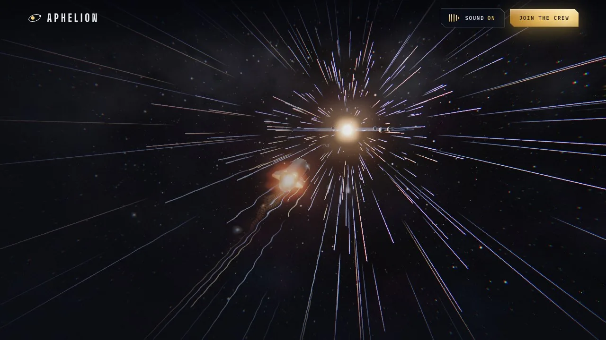
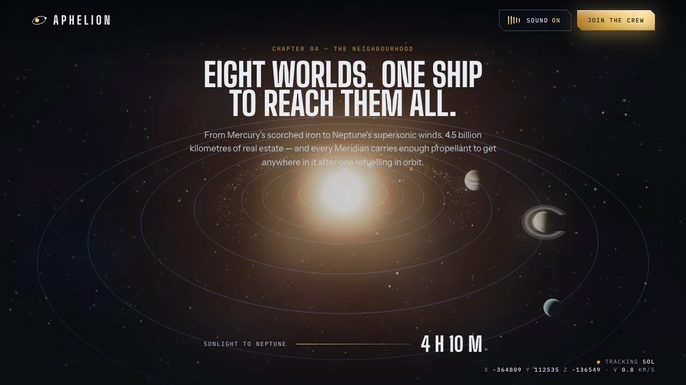
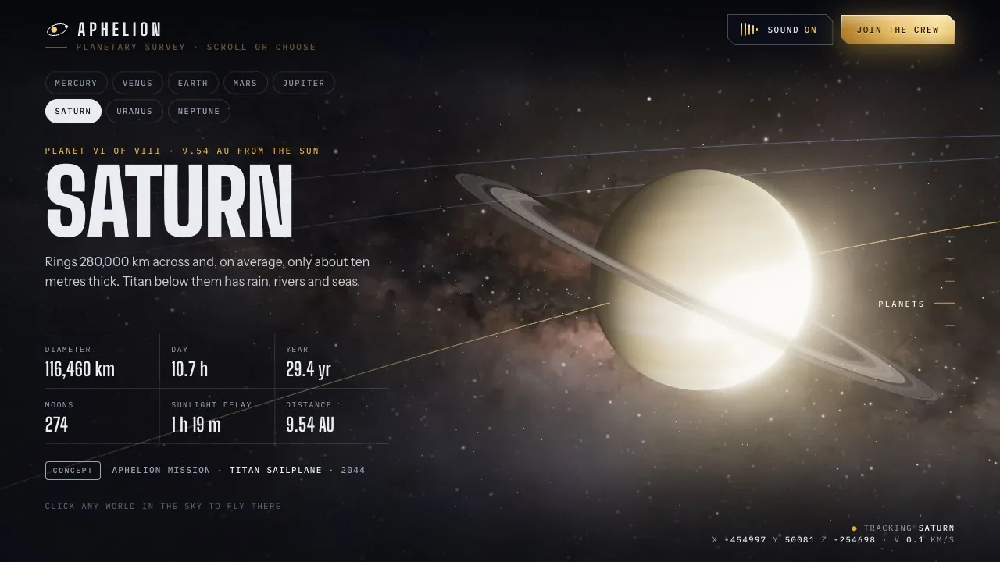

# Aphelion

**A scroll-driven WebGL flight from low Earth orbit to the edge of the solar system**, told as the website of a fictional space agency.

**Live:** https://jeroginaca.github.io/aphelion/



One continuous camera flies the whole page. You start over Earth and pass the orbital shipyard, where the starship assembles part by part as you scroll. Scrolling also charges the engines through a ten-second countdown. The ship then launches, warps out to the solar system and hands you a clickable survey of all eight planets.

| | |
|---|---|
|  |  |
|  |  |
|  |  |

## The problem

Most "3D scroll" sites are a hero model with sections stacked beneath it. I wanted the opposite: the page reads as **one shot**, where scrolling is the throttle and every chapter is a place the camera actually travels to. The constraints were a single static `index.html`, no build step, 60 fps on a laptop, and a version that still works on a phone or with reduced motion.

## How it works

**One camera, one timeline.** Each chapter owns a camera function `cams[i](progress)` that returns a position, a target and a framing offset. The frame loop eases the live camera toward whichever chapter the (smoothed) scroll position is in, so transitions are continuous rather than cut. The HUD in the corner reads the real camera coordinates and velocity.

**A countdown that scroll can't skip.** The launch chapter maps scroll to engine charge, but the count ticks at most one number per second, however fast you scroll. If you reach T-0 early, the page pins there, then hands the scroll to an autopilot for the 15-second liftoff and warp. Its speed curve is solved numerically so that the warp ends at a fixed point in the flight.

**Planets that never collide on screen.** The planets keep orbiting while you read, so any fixed camera angle eventually lines a neighbour up behind the one you're looking at. The survey camera checks the angular overlap of every other planet's disc against the focused one. When one would touch, it moves to the nearest clear viewing angle, and because the camera is eased, the change glides rather than cuts.

**Shaders first, photos on top.** Every planet has a procedural GLSL surface (noise-built terrain, banding and storms), plus atmosphere shells and Saturn's rings. The photographic maps are layered on as they arrive, so nothing is ever blank while it loads. Earth combines day, night-lights and drifting cloud layers with cloud shadows. The Milky Way backdrop is the NASA/Gaia all-sky map, sharpened in the shader so faint structure survives the bloom pass.

**Post-processing.** A half-float render target with MSAA feeds bloom, chromatic aberration, vignette, film grain and a heat-shimmer pass that only switches on behind the engines.

**Sound.** The ambient drone, radio crackle and servo whines are synthesized live with the Web Audio API. The countdown callouts are tiny embedded clips run through a radio filter chain, and an oscilloscope in the nav draws the live output.

**The UI is part of the world.** CTAs and data panels share one chamfered "plate" shape. Data sits on frosted HUD plates so it stays legible over bright 3D (a hull under floodlights, the Sun). The chapter rail collapses to ticks so it never covers the scene.

## Performance

The site is heavy by nature (textured planets, two glTF models and an 8K sky), so most of the work went into what loads when.

| | Before | After |
|---|---|---|
| Initial transfer (desktop) | 23.8 MB | **7.4 MB** |
| Initial transfer (mobile) | 16.0 MB | **4.9 MB** |
| Starship model | 2.2 MB | **249 KB** |
| Mobile LCP (Lighthouse, simulated 4G) | 33.6 s | **~4.2 s** |
| Desktop LCP (Lighthouse) | 1.5 s | **1.0 s** |
| Frame rate (Apple M4 Max, headless Chrome, 1440×900) | 52 fps | **60 fps** |

What changed:
- All textures moved to WebP. The starship's PNG maps were recompressed inside the glTF, and the ISS textures were halved and the model re-packed with meshopt.
- The 8K sky no longer blocks anything. A 4K version loads first, and large, high-DPI screens swap in the 8K once the page has settled.
- Phones get 2K Earth and 1K planet maps.
- Planet textures for the survey chapter, and the ISS on phones, wait until the hero is revealed and the main thread is idle.

Lighthouse (desktop): Best Practices 100 · SEO 100 · Accessibility 96 · Performance 68. The Performance score is capped by main-thread work at startup (shader compilation and scene construction), which a WebGL scene of this size can reduce but never avoid. On mobile, Lighthouse's 4× CPU throttle puts it at 48.

## Accessibility

- Respects `prefers-reduced-motion`: the camera follows the scroll directly, with no autopilot, pinning or count pacing, and UI transitions are switched off.
- Every control is a real `<a>` or `<button>` with visible focus. The countdown and the form feedback are `aria-live` regions.
- The manifesto lights up word by word as you scroll. Unlit words are intentionally dim, and that is the one remaining contrast flag in Lighthouse.

## Bugs found while polishing

- **The countdown could hang on T-01.** The T-0 pin landed on a whole pixel a fraction below the threshold, so the count settled just above zero until you scrolled again. It now allows a 2 px tolerance.
- **A smear grew across Earth the longer the page was open.** The clouds drift by offsetting their texture coordinate over time, and the texture was clamped instead of wrapped. It's wrapped now.
- **The page rendered in quirks mode** because the `<!doctype html>` was missing.

## What I'd do next

- Move the photographic maps to KTX2/Basis, which is smaller on the wire and far smaller in GPU memory.
- Split the 2,400-line `index.html` into modules with a small build step. Keeping it as one file is what lets it run with no tooling, but it has outgrown that.
- Add a lower-power quality tier chosen from a frame-time probe (no bloom, 1× DPR, fewer stars) for older phones.

## Run locally

It's a single self-contained `index.html`. Serve the folder:

```sh
python3 -m http.server 8765
```

three.js (r169) loads from jsDelivr, so you need an internet connection.

## Credits

- Star map: NASA/Goddard Space Flight Center Scientific Visualization Studio; Gaia DR2: ESA/Gaia/DPAC
- Planet textures: [Solar System Scope](https://www.solarsystemscope.com/textures/), CC BY 4.0, based on NASA imagery
- ISS model: NASA Visualization Technology Applications and Development (VTAD)
- Starship model: [Render Island](https://sketchfab.com/3d-models/spacex-starship-83d9d7d5e9c54d768f0c2c99d5ad50aa), CC BY 4.0
- Type: Big Shoulders Display, Instrument Sans, IBM Plex Mono (Google Fonts)

---
Aphelion Interplanetary Agency is a work of fiction. The planetary facts are real.
